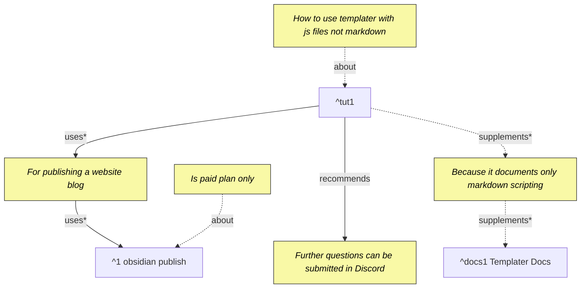

# 1 Add script for opening obsidian note quickly
# 2 Objective

For general setup, see [[Wk 25 000 Setting up time logging in Obsidian]].

I have `Lan Start Log` which logs to `scripts/templater/data/lan`. It uses `start_log.js` in `scripts/templater/` and the `Lan Start Log.md` basically passes it an identity like so:

```
<%*	await tp.user.start_log(tp, "lan");%>
```

So there will be a `Lan Open Timeline Log.md` that basically is like this, it uses `open_timeline_log.js` to open the log file corresponding to the last week log, like `scripts/templater/data/lan/Timeline-2025-06-Wk25`

The goal is for `Lan Open Timeline Log` to open the latest timeline file corresponding to this week, and if it doesn't exist, to create one with the the following template:

```
# 1 Time Logs

` ` `simple-time-tracker
{
  "entries": [
  ]
}
` ` `

```

Remove the spaces in the backticks, these were added for formatting here only.

# 3 LLM Instructions
- This is a diagnostic document and not a conversation. Everything shared is context. Address the questions tagged (Q#) like (Q1) for example. If you see something like (~1), assume it part of the archive and not a latest set of questions.
	- Since it keeps occurring, I ask Again
	- !!! NEVER RESPOND TO (~1), (~2), etc.
	- ONLY respond to the tagged questions. Nothing else.


# 4 Journal

2025-06-23 Wk 26 Mon - 12:34

Code for `start_log.js` will be provided.

## 4.1 (~1) Create `open_timeline_log.js`

Using LLM (chatgpt-4o),

```js
async function openTimelineLog(tp, identity) {
	const fs = tp.app.vault.adapter;

	const filename = getCurrentWeekFilename();
	const filePath = `scripts/templater/data/${identity}/${filename}`;

	await ensureTimelineFile(fs, filePath);
	await app.workspace.openLinkText(filePath, '/', false);
}

module.exports = openTimelineLog;
```


### 4.1.1 Common work between scripts

(~2) There is shared work between the different scripts. Extract this into a common library file: `timeline_log_common.js` and use its functions here. 

A new common script file was created with shared functions between start, stop, and open. But I cannot import it in those scripts.

(~1) Error:

```
Templater Error: Failed to load user script at "scripts/templater/open_timeline_log.js". 
 Cannot find module './timeline_log_common'
Require stack:
- electron/js2c/renderer_init
```

(~2) Error:
```
QuickAdd: (ERROR) Error running capture choice "Untitled Capture Choice": Failed to load user script at "scripts/templater/timeline_log_common.js". Default export is not a function. O: Error running capture choice "Untitled Capture Choice": Failed to load user script at "scripts/templater/timeline_log_common.js". Default export is not a function.
    at hi.load_user_script_function (plugin:templater-obsidian:17:236)
    at async hi.generate_user_script_functions (plugin:templater-obsidian:16:6635)
    at async hi.generate_object (plugin:templater-obsidian:17:377)
    at async Ai.generate_object (plugin:templater-obsidian:17:760)
    at async _i.generate_object (plugin:templater-obsidian:17:1442)
    at async Sn.parse_template (plugin:templater-obsidian:18:75200)
    at async M1 (plugin:quickadd:18:8242)
    at async Eb.run (plugin:quickadd:47:1049)
    at async b2.onChooseCaptureType (plugin:quickadd:50:1848)
    at async b2.execute (plugin:quickadd:50:1574)
logError @ plugin:quickadd:37
```
^error-obsidian-load1

2025-06-23 Wk 26 Mon - 14:19

Can't seem to find a way to include. This does not support ES6 module imports, nor `require`. 

We can still achieve this via C++ preproc help.

Glue `.hpp` files like `start_log.js.hpp` can be used:

```cpp
#include ".timeline_log_common.js"
#include "start_log.js.preproc"
```

Then the final files are generated on build via `run_timeline_log_preproc_build.sh`:

```sh
cpp -P start_log.js.hpp -o start_log.js
cpp -P stop_log.js.hpp -o stop_log.js
cpp -P open_timeline_log.js.hpp -o open_timeline_log.js
```

Vscode is still able to recognize `start_log.js.preproc` as a javascript file. The reason why `.timeline_log_common.js` starts with a dot is that otherwise the above error [[#^error-obsidian-load1]] would occur.

# 5 Issues

## 5.1 All files appear in Alt+E search

2025-06-23 Wk 26 Mon - 17:26

Ideally, should only see dedicated templates or comands.

But when setting `Template folder location`, it will show even the js files. This can be solved by creating a `commands` folder:  `scripts/templater/commands/*.md`


# 6 References
1. https://silentvoid13.github.io/Templater/ ^docs1
2.  https://shbgm.ca/blog/obsidian/how-to-use-templater-js-scripts ^tut1
3. https://obsidian.md/publish ^1


