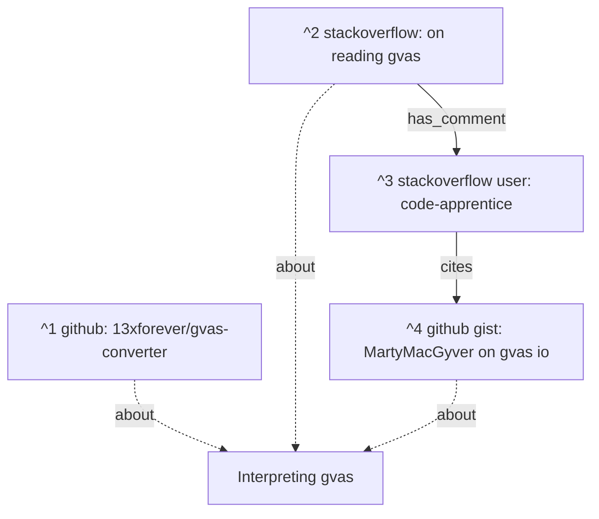

#lan #entry  #re #save #steam 


This relates to [[000 Copy save data from Clair Obscur Expedition 33]]. There, we find where t he save file is and copy it over for exploration:

```sh
mkdir -p ~/data/re/expedition-sav/
cp -r ~/data/backups/2025-07-01-expedition-save-data/EXPEDITION_0.sav ~/data/re/expedition-sav
```

# 1 Objective

Explore the save file for [`Clair Obscur: Expedition 33`](<https://store.steampowered.com/agecheck/app/1903340/>)

## 1.1 Identify the file format

2025-07-01 Wk 27 Tue - 18:48

```sh
# in /home/lan/data/re/expedition-sav
xxd EXPEDITION_0.sav | less

# output
00000000: 4756 4153 0300 0000 0a02 0000 f403 0000  GVAS............
[...]
```

It seems to have a `GVAS` file identifier.

[github: 13xforever/gvas-converter](<https://github.com/13xforever/gvas-converter>) [[#^1]] can be used to interpret these files.

From its description:

> [this tool] convert[s] the generic UE4 save game file into a json for easier analysis.


Though this is in C#...

Let's try to use [github gist: MartyMacGyver on gvas io](<https://gist.github.com/MartyMacGyver/ebeb8f803ef66be87c7c7d95d000ab42>) [[#^4]] first since it's on python.

```sh
mkdir -p /home/lan/data/re/expedition-sav/scripts
cd /home/lan/data/re/expedition-sav/scripts
curl https://gist.githubusercontent.com/MartyMacGyver/ebeb8f803ef66be87c7c7d95d000ab42/raw/3675e55c48644b75dd8a195c3895579ca9b4229e/ue4_save_game_extractor_recompressor.py > ue4_save_game_extractor_recompressor.py
chmod +x ue4_save_game_extractor_recompressor.py
```

```sh
cd /home/lan/data/re/expedition-sav
/home/lan/data/re/expedition-sav/scripts/ue4_save_game_extractor_recompressor.py --filename EXPEDITION_0.sav --extract

# output
Header bytes do not match: Expected 'BE 40 37 4A EE 0B 74 A3 01 00 00 00' got '47 56 41 53 03 00 00 00 0A 02 00 00 '
```

Okay seems we need to compress instead.

```sh
/home/lan/data/re/expedition-sav/scripts/ue4_save_game_extractor_recompressor.py --compress --filename EXPEDITION_0.sav
```

This creates `EXPEDITION_0.NEW.savegame`. According to the script, it created an archive according to

```python
# deompression
data_gvas = zlib.decompress(data_compressed)

# compression
compress = zlib.compressobj(
	level=zlib.Z_DEFAULT_COMPRESSION,
	method=zlib.DEFLATED,
	wbits=4+8,  # zlib.MAX_WBITS,
	memLevel=zlib.DEF_MEM_LEVEL,
	strategy=zlib.Z_DEFAULT_STRATEGY,
)
data_compressed += compress.compress(data_gvas)
```

## 1.2 Decompressing the zlib file

2025-07-03 Wk 27 Thu - 01:29

Based on [stackexchange: zlib decompress by Catskul](<https://unix.stackexchange.com/a/240060>) [[#^5]],

```sh
sudo apt-get install qpdf
```

```sh
# in /home/lan/data/re/expedition-sav
zlib-flate -uncompress < EXPEDITION_0.NEW.savegame > a

# output
zlib-flate: flate: inflate: data: incorrect header check
```

It is not going to be able to do it immediately because it's packed with other information. Let's modify the script to also just write the compressed archive:

```sh
# in /home/lan/data/re/expedition-sav
cp scripts/ue4_save_game_extractor_recompressor.py scripts/ue4_save_game_extractor_recompressor.1.py
```

Edit it to produce the following diff:

```sh
diff -u  scripts/ue4_save_game_extractor_recompressor.py scripts/ue4_save_game_extractor_recompressor.1.py
```

```diff
--- scripts/ue4_save_game_extractor_recompressor.py     2025-07-01 19:05:22.561601097 +0300
+++ scripts/ue4_save_game_extractor_recompressor.1.py   2025-07-03 01:41:51.026114272 +0300
@@ -92,8 +92,13 @@
             memLevel=zlib.DEF_MEM_LEVEL,
             strategy=zlib.Z_DEFAULT_STRATEGY,
         )
+
         data_compressed += compress.compress(data_gvas)
         data_compressed += compress.flush()
+
+        with open(filename_out + '.zlib', 'wb') as zlib_file:
+            compressed.write(data_compressed)
+
         compressed.write(HEADER_FIXED_BYTES)
         compressed.write(len(data_gvas).to_bytes(HEADER_RAW_SIZE_LEN, byteorder='little'))
         compressed.write(data_compressed)
```

Now let's compress again with our new script:

```sh
/home/lan/data/re/expedition-sav/scripts/ue4_save_game_extractor_recompressor.1.py --compress --filename EXPEDITION_0.sav
```

Now we should have `EXPEDITION_0.NEW.savegame.zlib`.

2025-07-03 Wk 27 Thu - 01:50

But we're not getting anything from decompressing it.

```sh
zlib-flate -uncompress < EXPEDITION_0.NEW.savegame.zlib
```

When we try to open the `*.sav` file with visidata, it recommends us to install

```sh
python3 -m pip install savReaderWriter
```

![[Pasted image 20250703015301.png]]

We can't import `'Iterable'`... [here](<https://stackoverflow.com/a/69882451/6944447>) they claim that it is deprecated.

Also the repository for [savReaderWriter](<https://bitbucket.org/fomcl/savreaderwriter/src/master/>) is very outdated (2016). Should Visidata recommend this? ^log-issue1

See [[#2.1 Filing to Visidata about outdated recommendation log-issue1|here]] for information on filing this issue.

2025-07-03 Wk 27 Thu - 01:59


# 2 Issues

## 2.1 Filing to Visidata about outdated recommendation [[#^log-issue1]]


# 3 Open Source Contribution Tasks

- [ ] Open issue in visidata about the savReaderWriter issue [[#^log-issue1]]


# 4 References
1. [github: 13xforever/gvas-converter](<https://github.com/13xforever/gvas-converter>) ^1
2. [stackoverflow: on reading gvas](<https://stackoverflow.com/questions/76498125/read-sav-file-with-gvas-format-in-python>) ^2
3. [stackoverflow user: code-apprentice](<https://stackoverflow.com/users/1440565/code-apprentice>) ^3
4. [github gist: MartyMacGyver on gvas io](<https://gist.github.com/MartyMacGyver/ebeb8f803ef66be87c7c7d95d000ab42>) ^4
5. [stackexchange: zlib decompress by Catskul](<https://unix.stackexchange.com/a/240060>) ^5


